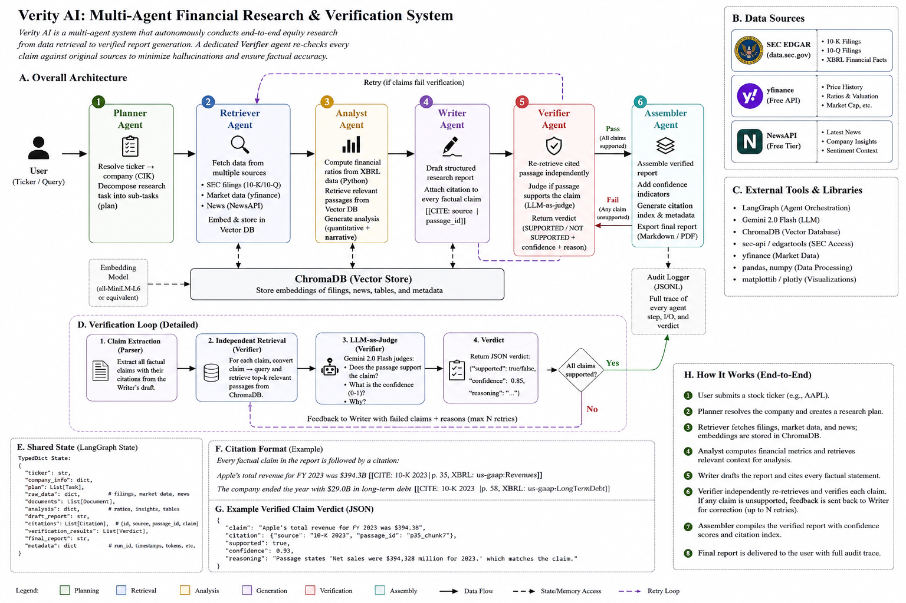
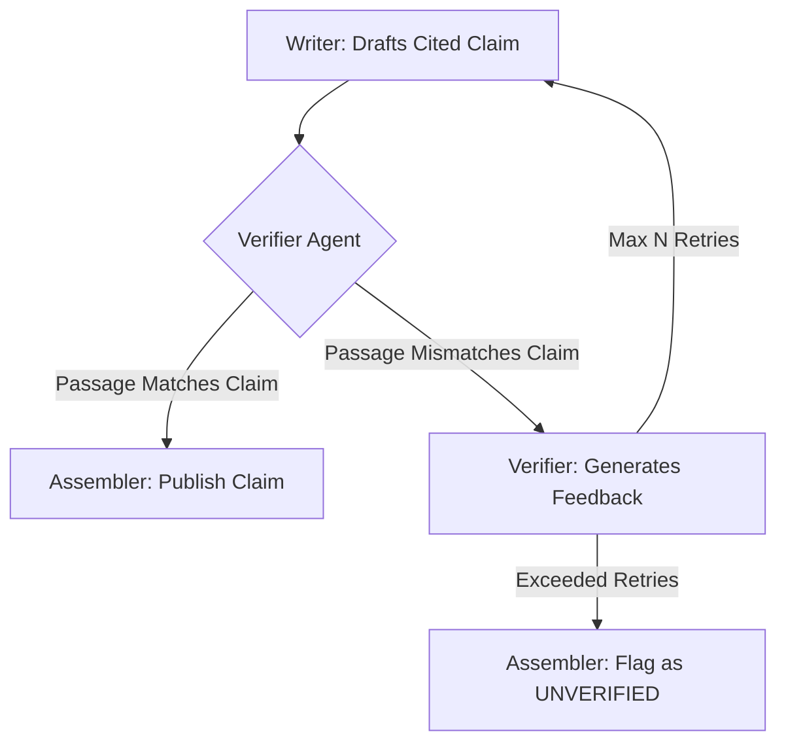

# Verity 📊 — Multi-Agent Financial Research & Anti-Hallucination Verification System

[](https://www.python.org/)
[](https://github.com/langchain-ai/langgraph)
[](https://ai.google.dev/)
[](https://fastapi.tiangolo.com/)
[](https://streamlit.io/)

> **Give it a stock ticker.** A team of 6 LLM agents retrieves real SEC filings, computes financial ratios from XBRL data, and drafts a cited equity research report — and then **a dedicated Verifier agent re-checks every claim against its source before the report ships**, flagging anything it can't back up.

---

## 🏛️ System Architecture

Verity uses **LangGraph's** explicit state-graph routing to build a multi-agent assembly line. Each agent is modeled as a specialized node with typed state, allowing deterministic loops, real-time logging, and absolute visibility.



### Agent Roles & Responsibilities

| Agent | Model | Primary Responsibility |
|:---|:---|:---|
| **Planner** | Gemini 2.0 Flash | Resolves ticker to CIK, decomposes research questions, and plans ratio calculations |
| **Retriever** | Gemini 2.0 Flash | Downloads 10-K/10-Q SEC EDGAR filings, market metrics (yfinance), and embeds them into ChromaDB |
| **Analyst** | Gemini 2.0 Flash | Executes deterministic python code to compute financial ratios from XBRL data and extracts context |
| **Writer** | Gemini 2.0 Flash | Drafts the equity report, attaching a strict citation tag `[[CITE: source | passage]]` to every single claim |
| **Verifier** | Gemini 2.0 Flash | **Core Differentiator:** Independently retrieves cited passages, LLM-evaluates accuracy, and triggers correction loop |
| **Assembler** | Gemini 2.0 Flash | Merges verified report segments, flags unverified claims, and compiles the final verification index |

---

## 🔍 Core Differentiator: The Verifier Agent

Most LLM research pipelines generate output and trust it blindly. **Verity is built to catch its own hallucinations.** 



1. **Inline Citations:** The Writer must back up every factual assertion with a `[[CITE: source | passage]]` tag.
2. **Independent Check:** The Verifier pulls the source passage from the ChromaDB vector store *independently* (without trusting the Writer's representation).
3. **Factual Critique:** It queries the Gemini model using a strict JSON schema to judge the alignment:
   - **Supported:** (True/False)
   - **Confidence:** (0.0 to 1.0)
   - **Reasoning:** Diagnostic description of discrepancies.
4. **Correction Loop:** If a claim fails validation (e.g., claiming a revenue of "$500B" when the filing says "$300B"), the Verifier pushes the feedback back to the Writer for a rewrite. If it fails after `VERIFIER_MAX_RETRIES`, it is marked as `[UNVERIFIED]` in the final report.

---

## ⚡ Technical Highlights

- ** LangGraph Orchestration:** Unlike unstructured multi-agent setups (e.g. CrewAI), LangGraph provides explicit control over the Writer ⇄ Verifier feedback loops and maintains state history.
- **Deterministic Analysis:** Rather than asking an LLM to do arithmetic (which leads to calculation errors), the Analyst agent runs isolated Python calculations on raw XBRL values retrieved from the SEC.
- **Fair-Access SEC EDGAR Client:** Incorporates the required user-agent headers, handles CIK mappings, and enforces rate limit delays according to the SEC Developer guidelines.

---

## ⚙️ Quick Start

### 1. Clone & Set Up Virtual Environment
```bash
git clone https://github.com/prem151105/verity-ai.git
cd verity-financial-research

# Create and activate environment
python -m venv .venv
# On Windows
.venv\Scripts\activate
# On Mac/Linux
source .venv/bin/activate
```

### 2. Install Dependencies
```bash
pip install -r requirements.txt
```

### 3. Configure API Keys
Copy `.env.example` to `.env` and fill in your Gemini API key and SEC user-agent header:
```bash
# Edit .env
GEMINI_API_KEY=your_gemini_api_key_here
SEC_USER_AGENT=YourCompanyName contact@yourdomain.com
```

### 4. Run the Application
Start the FastAPI backend server:
```bash
uvicorn api.main:app --reload --host 0.0.0.0 --port 8000
```

Start the Streamlit UI dashboard in a separate terminal:
```bash
streamlit run ui/app.py
```
Open [http://localhost:8501](http://localhost:8501) in your browser.

---

## 📈 Evaluation Results

We ran automated evaluations across multiple major companies (10-Ks) to measure system reliability.

See the complete performance metrics in [eval/results.md](file:///d:/PROJECTS/verity-financial-research/eval/results.md):
- **Citation Coverage:** percentage of factual claims backed by a valid, verifiable citation (target: >85%).
- **Verification Accuracy:** LLM-as-a-judge score of fact-matching consistency.
- **Latency:** E2E runtime for full graph traversal.

Run evaluation script locally:
```bash
python eval/eval.py
```

---

## 📂 Project Structure

```
verity-financial-research/
├── agents/
│   ├── state.py         # LangGraph shared state schemas
│   ├── graph.py         # StateGraph builder and entry points
│   ├── planner.py       # Ticker mapping & subtask decomposer
│   ├── retriever.py     # SEC EDGAR, yfinance, and vector store loader
│   ├── analyst.py       # Deterministic math executor & context chunker
│   ├── writer.py        # Drafts cited reports
│   ├── verifier.py      # Citation verification engine
│   ├── assembler.py     # Final report compiler
│   ├── llm.py           # Model singletons
│   └── audit_logger.py  # Audit trail logs
├── tools/
│   ├── edgar_client.py  # SEC filing downloader
│   ├── yfinance_client.py
│   ├── vector_store.py  # Chroma DB vector database client
│   └── code_executor.py # Isolated calculation runner
├── api/
│   ├── main.py          # FastAPI application server
│   └── models.py        # Pydantic schema validation models
├── ui/
│   └── app.py           # Streamlit dashboard
├── eval/
│   ├── eval.py          # Eval suite
│   └── results.md       # Measured latency/citation coverage results
├── tests/               # Pytest suite
└── audit_logs/          # Generated JSONL reports (gitignored)
```
