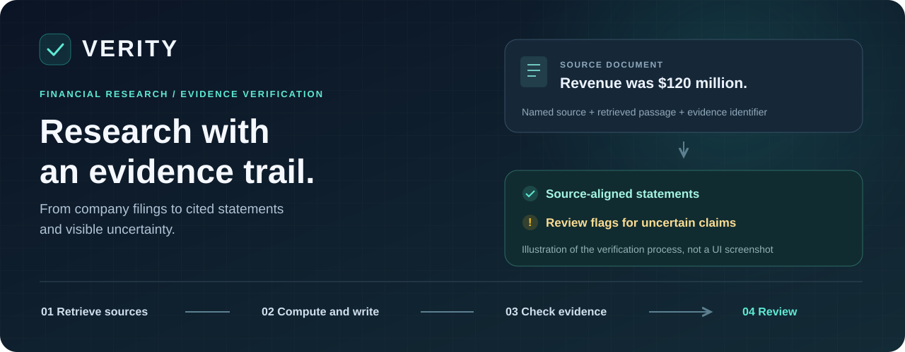
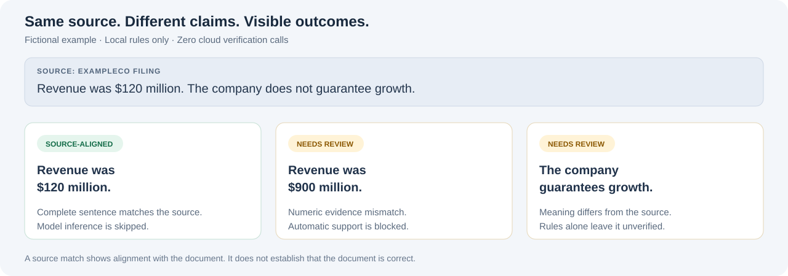
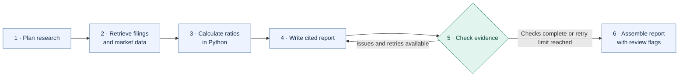
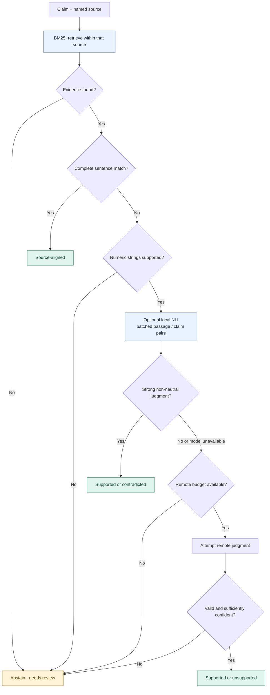

<p align="center">
  
</p>

<h1 align="center">Verity</h1>
<p align="center"><strong>Financial research you can trace back to the evidence.</strong></p>
<p align="center">
  <a href="https://www.python.org/"></a>
  <a href="https://github.com/langchain-ai/langgraph"></a>
  <a href="https://fastapi.tiangolo.com/"></a>
  <a href="https://www.sbert.net/"></a>
</p>
<p align="center">
  <a href="#what-verity-does">Overview</a> ·
  <a href="#see-the-difference">Example</a> ·
  <a href="#how-it-works">Architecture</a> ·
  <a href="#quick-start">Quick start</a> ·
  <a href="#research-and-validation">Research</a>
</p>

---

## What Verity does

**Enter a stock ticker. Get a cited research report with an evidence trail and visible review flags.**

Verity retrieves company filings and market data, calculates financial ratios in Python, drafts a report, and checks cited statements against independently retrieved documents. When evidence is missing or a check remains uncertain, the statement stays unverified.

For a reviewer, this means less time hunting for source passages. For an ML researcher, it provides a small, inspectable system for studying retrieval, local inference, selective computation, and abstention.

| You need… | Verity provides… |
|---|---|
| Traceable research | Named sources, retrieved passages, and evidence identifiers |
| Reproducible calculations | Financial ratios computed from structured data |
| Efficient verification | Local matching, batched optional NLI, and limited remote escalation |
| Visible uncertainty | Explicit review flags when evidence or judgments are insufficient |

## See the difference



The illustration uses the implemented **rules-only** path. A complete sentence match can skip model inference. A changed number triggers the numeric guard. A statement that requires interpreting negation remains unverified until a model or reviewer checks it.

Try the same example locally—no API key or model download required:

```python
from research.cascade import Cascade

source = "ExampleCo filing"
documents = [{"source": source, "text":
    "Revenue was $120 million. The company does not guarantee growth."}]
claims = [{"source": source, "claim": text} for text in [
    "Revenue was $120 million.",
    "Revenue was $900 million.",
    "The company guarantees growth.",
]]

result = Cascade().verify(claims, documents)
for claim, verdict in zip(claims, result["verdicts"]):
    print(verdict["decision"], "—", claim["claim"])
print("Cloud judgments:", result["metrics"]["remote_attempts"])
```

```text
supported — Revenue was $120 million.
abstain — Revenue was $900 million.
abstain — The company guarantees growth.
Cloud judgments: 0
```

## How it works

### From ticker to reviewed report


```mermaid
flowchart LR
    P["1 · Plan research"] --> R["2 · Retrieve filings<br/>and market data"]
    R --> A["3 · Calculate ratios<br/>in Python"]
    A --> W["4 · Write cited report"]
    W --> V{"5 · Check evidence"}
    V -->|"Issues and retries available"| W
    V -->|"Checks complete or retry limit reached"| F["6 · Assemble report<br/>with review flags"]
    classDef step fill:#edf4ff,stroke:#567ba8,color:#172c46;
    classDef check fill:#e1f5ee,stroke:#22836a,color:#124a3d;
    class P,R,A,W,F step;
    class V check;
```

LangGraph makes the workflow and correction loop explicit. The verifier retrieves from the actual source documents; the writer's quoted passage cannot verify itself.

### BACE: spend verification effort selectively

**Budgeted, Anchored Claim Evaluation (BACE)** is Verity's proposed routing algorithm. It combines established retrieval and inference techniques into a source-aware verification policy.

<details>
<summary><strong>Explore the full verification decision tree</strong></summary>


```mermaid
flowchart TD
    C["Claim + named source"] --> R["BM25: retrieve within that source"]
    R --> E{"Evidence found?"}
    E -->|No| U["Abstain · needs review"]
    E -->|Yes| X{"Complete sentence match?"}
    X -->|Yes| S["Source-aligned"]
    X -->|No| N{"Numeric strings supported?"}
    N -->|No| U
    N -->|Yes| M["Optional local NLI<br/>batched passage / claim pairs"]
    M --> T{"Strong non-neutral judgment?"}
    T -->|Yes| D["Supported or contradicted"]
    T -->|"No or model unavailable"| B{"Remote budget available?"}
    B -->|No| U
    B -->|Yes| L["Attempt remote judgment"]
    L --> Q{"Valid and sufficiently confident?"}
    Q -->|No| U
    Q -->|Yes| O["Supported or unsupported"]
    classDef local fill:#e9f2ff,stroke:#6485b5,color:#172c46;
    classDef aligned fill:#e1f5ee,stroke:#22836a,color:#124a3d;
    classDef review fill:#fff3d6,stroke:#b78924,color:#654b12;
    class R,M local;
    class S,D,O aligned;
    class U review;
```

</details>


| Stage | What it does | Why it matters |
|---|---|---|
| Source anchoring | Searches only the cited source | Prevents unrelated documents from backing a claim |
| Exact matching | Accepts complete normalized sentence matches | Avoids unnecessary inference for copied statements |
| Numeric guard | Flags numeric strings absent from the selected passage | Blocks automatic support when numbers do not align |
| Local NLI | Uses a pretrained DeBERTa cross-encoder in batches of 16 | Adds semantic judgments on the local machine |
| Budgeted escalation | Prioritizes uncertain cases for limited remote judgments | Makes the remote-work/review tradeoff explicit |
| Output validation | Rejects malformed or uncertain model responses | Keeps failed checks from becoming supported claims |

The remote budget persists across report rewrites. Duplicate claims share judgments within an invocation. Evidence hashes and audit logs make routes inspectable.

**Default model policy:** score ≥ `0.95` and margin ≥ `0.20` for local decisions. These are uncalibrated routing thresholds, not factual reliability guarantees.

## Quick start

### 1. Install

Use Python 3.10+ and run commands from the repository root:

```bash
python -m venv .venv
```

Activate the environment:

```powershell
# Windows PowerShell
.venv\Scripts\Activate.ps1
```

```bash
# macOS / Linux
source .venv/bin/activate
```

```bash
pip install -r requirements.txt
```

### 2. Configure

Copy [.env.example](.env.example) to `.env`. Set your `GEMINI_API_KEY` and a descriptive `SEC_USER_AGENT` with your contact email.

```dotenv
GEMINI_API_KEY=your_key_here
SEC_USER_AGENT=YourName/1.0 contact@example.com
VERIFICATION_BACKEND=rules
VERIFICATION_REMOTE_BUDGET=2
```

### 3. Start the application

```bash
uvicorn api.main:app --reload --host 127.0.0.1 --port 8000
```

In a second terminal:

```bash
streamlit run ui/app.py
```

Open the [research dashboard](http://localhost:8501) and enter a ticker such as `AAPL`. Explore endpoints in the [API documentation](http://localhost:8000/docs).

### Optional: enable local neural inference

```bash
pip install -r requirements-local.txt
```

Set `VERIFICATION_BACKEND=torch` or `VERIFICATION_BACKEND=onnx`. The adapter loads `cross-encoder/nli-deberta-v3-small` at a pinned revision. First use downloads weights; ONNX may also export model artifacts.

| Mode | Local verification | Remote verification |
|---|---|---|
| Standalone `Cascade()` / `POST /verify` | Rules only | Disabled |
| Full research, `rules` | Matching and numeric guards | Up to the configured budget |
| Full research, `torch` or `onnx` | Rules + batched local NLI | Uncertain cases within budget |

Set `VERIFICATION_REMOTE_BUDGET=0` to disable remote **verification**. The full research workflow still uses Gemini generation and Chroma embeddings.

## API at a glance

| Endpoint | Purpose |
|---|---|
| `POST /research/{ticker}` | Start a research job and receive a run ID |
| `GET /research/{run_id}` | Retrieve the report after the job completes |
| `POST /verify` | Check supplied claims against supplied documents locally |
| `GET /health` | Inspect service health |

Example `/verify` request body:

```json
{
  "documents": [{"source": "ExampleCo filing", "text": "Revenue was $120 million."}],
  "claims": [{"source": "ExampleCo filing", "claim": "Revenue was $900 million."}]
}
```

The result contains verdicts, evidence, reasons, routes, and metrics. This claim receives `decision: "abstain"` with `route: "numeric_guard"`. The endpoint checks alignment with caller-supplied documents; it does not authenticate them.

## Research and validation

The core contribution is the **verification system and routing policy** around a pretrained model. The project does not establish a new foundation model or academic novelty.

| Evidence available | Status |
|---|---|
| Core correctness and failure handling | 35 tests passed during the implementation check |
| Rules-only example above | Reproducible without external services |
| Neural financial-domain accuracy | Requires human-labeled evaluation and calibration |
| Torch vs ONNX latency | Requires measurement on target hardware |
| Full-pipeline cloud savings | Requires token, retry, and pricing measurements |

Run the tests:

```bash
pip install pytest requests responses pydantic pydantic-settings fastapi httpx
python -m pytest -q
```

Coverage includes fabricated sources, numeric errors, negation, duplicate claims, changed evidence, malformed model outputs, exhausted budgets, API validation, and financial calculations.

The existing live evaluation is available with `python -m eval.eval`; it uses network/model services. Its model-judge scores are not ground-truth factual accuracy.

For the next research experiment, use human-labeled financial claims split by company and filing date. Calibrate thresholds on a separate split, then compare rules-only, local NLI, remote-only, and budgeted routing. Report support precision, recall, abstention rate, decision coverage, latency, and cost together.

## Project map

```text
verity-ai/
├── research/          # Evidence retrieval, BACE policy, local NLI adapter
├── agents/            # LangGraph research and correction workflow
├── tools/             # SEC, market data, vector storage, financial calculations
├── api/               # Research service and local verification endpoint
├── ui/app.py          # Streamlit research dashboard
├── tests/             # Core behavior and failure handling
├── eval/eval.py       # Live research evaluation
├── assets/readme/     # The two illustrations used in this README
├── config.py          # Environment-based settings
└── requirements*.txt # Application and optional local ML dependencies
```

## Boundaries to understand

- **Source alignment is not truth.** A matching source can itself be wrong or lack context.
- **Abstention is a useful outcome.** Tables, numeric format changes, derived ratios, and cross-sentence reasoning can require review. Source names must match exactly.
- **Model scores need calibration.** The NLI model was trained on general-domain data; long inputs may be truncated at 512 tokens.
- **The budget covers logical judgments.** Transport retries, generation calls, tokens, dollars, and total runtime are separate.
- **This is a research prototype.** The API uses in-memory job state and lacks authentication and a distributed queue. The verifier does not detect every uncited factual statement.

## Research foundations

| Source | Role in Verity |
|---|---|
| [FrugalGPT](https://arxiv.org/abs/2305.05176) | Motivation for cost-aware model cascades; Verity uses a fixed heuristic policy |
| [Sentence Transformers inference backends](https://www.sbert.net/docs/cross_encoder/usage/efficiency.html) | Torch and ONNX execution options |
| [DeBERTa NLI model card](https://huggingface.co/cross-encoder/nli-deberta-v3-small) | Pretrained model provenance and class ordering |

Published results from these sources are not Verity's measured results.
