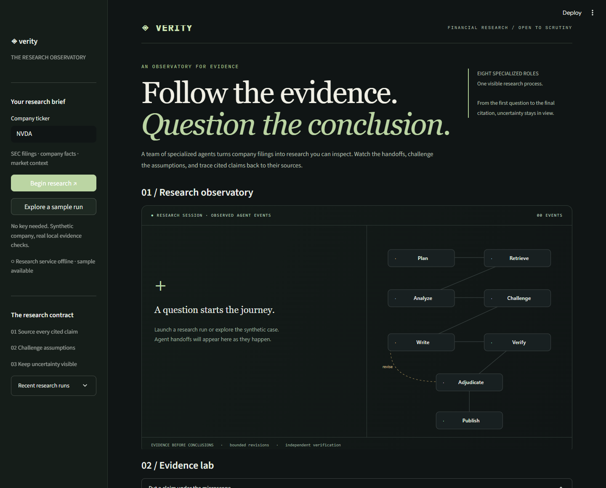
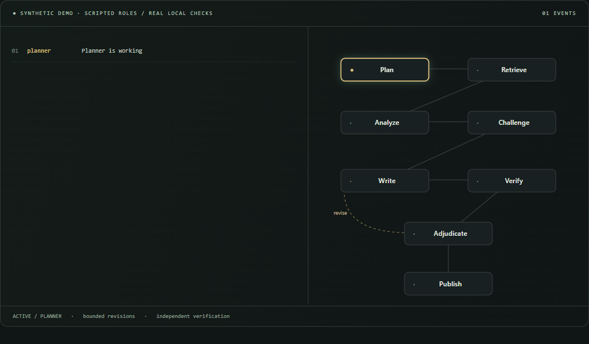
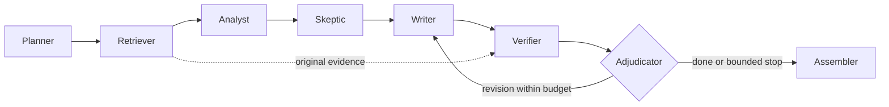

<div align="center">

# ◈ Verity

### Follow the evidence. Question the conclusion.

A financial research app that helps you understand a company and check the sources behind its report.

[Try it](#try-it) · [How it works](#the-research-process) · [API](#api) · [Development](#development)

</div>

---

Verity brings company filings, market data, and source checks into one workspace.

Enter a company ticker to get a research note with financial ratios and citations. Verity gathers the data, reviews the analysis, and checks cited claims against the source text. When a claim needs a correction, it asks for a revision. Anything still unresolved stays flagged for you to review.

You can follow each step, read the source excerpts, see what needs another look, and download the results.



## Watch the evidence change the report



*This sample uses a fictional company and prepared data. The source checker runs locally, so you can try it without an API key. It demonstrates the workflow rather than live company research.*

The sample report says revenue was $900 million, but the source says $120 million. Verity catches the mismatch, asks for a correction, and checks the updated claim again.

A complete live NVIDIA run has also been checked with Gemini, SEC filings, and yfinance. See the [live validation record](docs/live-validation.md) and [saved report](reports/NVDA_live_research.md), including its unresolved verification flags.

## What you can do

| Feature | What it gives you |
|---|---|
| Research progress | Follow each step in the activity log and workflow map |
| Source checks | See which claims match their sources and which need review |
| Second look | Review assumptions, gaps, and evidence that could change the analysis |
| Report corrections | Revise claims when the checker finds a concrete error, within a set review limit |
| Evidence lab | Paste a claim and source passage for local, key-free checking |
| Run history | Revisit saved results after restarting the API |
| Stop control | Stop a run when its current step finishes |
| Exports | Download the research note as Markdown and the run record as JSON |
| Offline sample | Explore the interface without keys or external data services |

## Try it

Python 3.10+ is required. Create a virtual environment and install the dependencies:

```bash
python -m venv .venv
```

```powershell
# Windows PowerShell
.venv\Scripts\Activate.ps1
```

```bash
# macOS / Linux
source .venv/bin/activate
```

```bash
pip install -r requirements.txt
python run_app.py
```

The launcher starts the research API and dashboard together and opens [localhost:8501](http://localhost:8501). On Windows you can also double-click `start.bat`. Configure the Gemini key in `.env` first. To explore without a key, start only the dashboard with `streamlit run ui/app.py` and choose **Explore a sample run**. The sample and evidence lab work without the API, Gemini, or network access. The optional web fonts may fall back to system fonts offline.

### Configure live company research

Copy [.env.example](.env.example) to `.env`, then configure your model key and SEC contact identity:

```dotenv
GEMINI_API_KEY=your_key_here
SEC_USER_AGENT=YourName/1.0 contact@example.com
VERIFICATION_BACKEND=rules
VERIFICATION_REMOTE_BUDGET=24
RESEARCH_MODE=fast
VERIFIER_MAX_RETRIES=2
```

Start both services with `python run_app.py` or double-click `start.bat`. For separate terminals, start the API with:

```bash
uvicorn api.main:app --host 127.0.0.1 --port 8000
```

Refresh the dashboard, enter a ticker such as `AAPL`, and choose **Begin research**. Live runs need network access and use Gemini generation, SEC EDGAR, and yfinance. Document retrieval defaults to persistent local BM25, which avoids embedding-service quota. Optional semantic retrieval requires `pip install -r requirements-semantic.txt` and `RETRIEVAL_BACKEND=gemini`; it uses batched `gemini-embedding-001` vectors. Optional news retrieval uses `NEWS_API_KEY`. Model availability and quotas depend on your provider account. Configure `GEMINI_MODEL` if needed.

`VERITY_API_URL` can point the dashboard at another API address. Put credentials in the private `.env` file, never in `.env.example`. The configured model must be available to your account; `gemini-3-flash-preview` was verified in the live check. Keys are configured on the API server; the dashboard does not collect or change a shared server key.

## The research process


```mermaid
flowchart LR
    P[Planner] --> R[Retriever]
    R --> A[Analyst]
    A --> S[Skeptic]
    S --> W[Writer]
    W --> V[Verifier]
    V --> J{Adjudicator}
    J -->|revision within budget| W
    J -->|done or bounded stop| F[Assembler]
    R -. original evidence .-> V
```

| Role | Responsibility |
|---|---|
| Planner | Resolve the company and prepare a research brief |
| Retriever | Gather filings, XBRL facts, market data, and optional news; retain independent text |
| Analyst | Compute ratios in Python and interpret the supplied data |
| Skeptic | Challenge the analysis using targeted risk excerpts; distinguish observations from hypotheses |
| Writer | Draft the note with exact source labels and address the review |
| Verifier | Check cited claims against original retrieved evidence; preserve uncertainty |
| Adjudicator | Decide whether to revise or stop; never convert an unsupported claim into a supported one |
| Assembler | Package the report, citations, and unresolved flags |

The eight roles run in order. Some use Gemini, while others use Python to calculate values, decide whether another review is needed, or package the report.

### Running the workflow

The [Python runtime](agents/runtime.py) passes results from one step to the next and records progress as it happens. The API saves those updates under the same run ID. Developers can use `build_graph()`, `.invoke()`, and `.stream()` to run the workflow.

If the service restarts during a run, that run is marked **interrupted**. Its saved progress remains available, but it does not resume automatically.

## How verification works

Each cited claim goes through a series of source checks:

1. Retrieve source-scoped sentences with BM25.
2. Accept complete exact matches and narrowly defined financial field observations. Compare rounded values at their displayed precision, preserving percent units, field identity, issuer identity, and polarity. Flag genuine numeric mismatches.
3. Optionally apply a local NLI model to remaining passage–claim pairs.
4. Judge remaining candidates in one structured Gemini batch within the configured claim budget; abstain on missing, uncertain, or invalid verdicts. Cache determinate judgments only while the source content and issuer context remain unchanged.

Fast mode uses local planning, arithmetic summaries, and an excerpt-based review contract. Gemini writes the report and judges unresolved claims in a batch. `RESEARCH_MODE=deep` enables additional model planning, analysis, and skeptical review. A full rewrite is requested only when the checker provides a concrete correction; insufficient evidence is flagged without regenerating the report. Truncated provider output is retried with a larger output allowance or fails explicitly.

The writer's quotation is never treated as independent evidence. The remote verification budget carries across report revisions. It counts logical claim judgments, not provider retries, tokens, dollars, generation calls, or embeddings.

```python
from research.cascade import Cascade

result = Cascade().verify(
    claims=[{"source": "example", "claim": "Revenue was $900 million."}],
    documents=[{"source": "example", "text": "Revenue was $120 million."}],
)
print(result["verdicts"][0]["decision"])
# abstain — needs review; no cloud call
```

For optional neural verification, install `requirements-local.txt` and set `VERIFICATION_BACKEND=torch` or `onnx`. First use downloads a pinned DeBERTa NLI model; ONNX may export artifacts. Thresholds remain uncalibrated for finance. Setting the remote budget to zero disables remote **verification**, not Gemini generation or optional semantic embeddings used in live research.

## API

Interactive documentation: [localhost:8000/docs](http://localhost:8000/docs).

| Endpoint | Behavior |
|---|---|
| `POST /research/{ticker}` | Start a live research run; returns a run ID |
| `GET /research/{run_id}` | Report and review details; HTTP 202 while running |
| `GET /research/{run_id}/events?after=0` | Ordered lifecycle events after a sequence cursor and current run status |
| `POST /research/{run_id}/cancel` | Request a stop at the next agent boundary |
| `GET /research/{run_id}/citations` | Claim-level verification records |
| `GET /research/{run_id}/trace` | Tool and agent audit entries |
| `GET /runs` | Recent saved runs |
| `POST /verify` | Local rules-only checking of supplied claims and documents |
| `GET /health` | Service availability and model-configuration status |

## Development

```bash
python -m pytest -q
```

Tests cover the correction loop, stagnation, cancellation, missing evidence, failure propagation, identity preservation, persisted events, restart status, source attribution, numeric guards, remote budgets, API validation, and financial calculations. These are behavior tests, not a financial-domain accuracy evaluation.

```text
agents/       Specialized roles, custom runtime, synthetic demo
research/     Source-scoped retrieval and verification cascade
api/          Live events, background jobs, SQLite run snapshots
ui/           Streamlit observatory and shared diagram renderer
tools/        SEC / market access, computation, vector storage
docs/         Live validation notes
```

Recreate the screenshots and GIF with a running dashboard:

```bash
pip install playwright pillow
playwright install chromium
python tools/capture_observatory.py
```

`python -m eval.eval` uses live data and model services. To evaluate report quality, compare claims against a manually reviewed set of company filings and track errors, unresolved claims, runtime, and cost.

## Limitations

Source agreement does not establish truth. Verification checks extracted citations; uncited factual claims are not comprehensively detected. Exact source naming, tables, derived metrics, complex unit conversions, multi-sentence claims, and context truncation remain limitations. The skeptical review is model-generated commentary, not independently verified evidence.

This is a local research prototype. The API has no authentication or distributed queue and allows at most two concurrent runs per process. Keep it on a trusted local interface. Cancellation waits for an active agent to finish; checkpoints do not provide automatic resume. The new orchestration has not established better investment accuracy, reduced hallucinations, or lower provider cost on a live financial benchmark.
