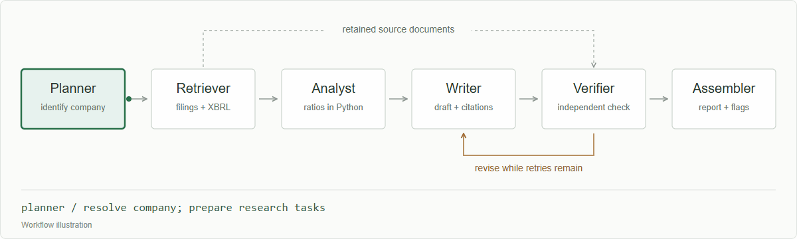

# Verity

Financial research from SEC filings, with a second pass over the evidence.

[Getting started](#getting-started) · [How it works](#how-it-works) · [Verification](#verification) · [Development](#development)

A citation can look convincing and still point to the wrong evidence. Verity is built around checking that gap: it takes a stock ticker, gathers company filings and market data, calculates financial ratios, and writes a report. A separate verifier checks the cited statements against the retrieved documents and sends problems back for revision.

The report includes its citations and flags anything the verifier could not support. You can run the full research app or use the verification engine on documents you already have.

## How it works



*The animation shows execution order and one possible rewrite, not a live run. [Still version](assets/readme/agent-workflow.svg).*

The six nodes share state through LangGraph:

- **Planner → Retriever:** resolve the company, prepare research tasks, then fetch SEC filings, XBRL facts, and market data. The original documents are retained alongside the retrieval index.
- **Analyst → Writer:** calculate ratios in Python, interpret the results, and draft a report with structured citations. Arithmetic stays in code.
- **Verifier → Assembler:** retrieve evidence within the cited source, judge the claims, and return feedback while retries remain. Assemble the final report with its citation index and unresolved flags.

The verifier never uses the writer's quoted passage as independent evidence. Its input is the source text retained during retrieval. See [the graph](agents/graph.py) and [verifier integration](agents/verifier.py).

## Getting started

Python 3.10+ is required. From the repository root, create and activate a virtual environment:

```bash
python -m venv .venv
```

```powershell
# Windows PowerShell
.venv\Scripts\Activate.ps1
```

```bash
# macOS / Linux
source .venv/bin/activate
```

Install the application dependencies:

```bash
pip install -r requirements.txt
```

Copy [.env.example](.env.example) to `.env` and set your Gemini key and SEC contact identity:

```dotenv
GEMINI_API_KEY=your_key_here
SEC_USER_AGENT=YourName/1.0 contact@example.com
```

Start the API, then the dashboard in a second terminal:

```bash
uvicorn api.main:app --reload --host 127.0.0.1 --port 8000
```

```bash
streamlit run ui/app.py
```

Open [localhost:8501](http://localhost:8501), enter a ticker such as `AAPL`, and start the research run. The full workflow needs network access and uses Gemini for generation and embeddings.

## Verification

The verification engine can also run by itself. This example uses only local rules and the Python standard library:

```python
from research.cascade import Cascade

result = Cascade().verify(
    claims=[{"source": "example", "claim": "Revenue was $900 million."}],
    documents=[{"source": "example", "text": "Revenue was $120 million."}],
)

verdict = result["verdicts"][0]
print(verdict["decision"], verdict["route"])
# abstain numeric_guard
```

Here, `abstain` means the claim needs review. No cloud call is made. The returned verdict also includes the retrieved evidence and the reason for the decision.

### Where the model fits

The routing policy is called **BACE**—Budgeted, Anchored Claim Evaluation. It follows a short sequence:

1. Retrieve sentences with BM25, restricted to the named source.
2. Accept complete sentence matches. Flag missing evidence and numeric mismatches for review.
3. If enabled, run a local DeBERTa NLI model on the remaining passage–claim pairs.
4. Send uncertain cases for remote judgment until the verification budget is spent; leave the rest unverified.

Identical claims share a judgment within a verification pass. The remote budget carries across report rewrites. Malformed or uncertain model responses cannot mark a claim as supported.

Configure the full workflow in `.env`:

```dotenv
VERIFICATION_BACKEND=rules
VERIFICATION_REMOTE_BUDGET=2
```

For local neural inference, install the optional dependencies and change the backend:

```bash
pip install -r requirements-local.txt
```

Set `VERIFICATION_BACKEND=torch` or `onnx`. The adapter uses a pinned revision of [DeBERTa NLI](https://huggingface.co/cross-encoder/nli-deberta-v3-small), with batches of 16. First use downloads the model; ONNX may export artifacts. Local decisions require a score of at least 0.95 and a margin of 0.20. Those thresholds still need financial-domain calibration.

Setting the remote budget to `0` disables cloud verification. It does not disable the generation and embedding calls used elsewhere in the research workflow. The budget counts logical claim judgments, not retries, tokens, or dollars.

## API

Interactive documentation is at [localhost:8000/docs](http://localhost:8000/docs).

| Request | Result |
|---|---|
| `POST /research/{ticker}` | Starts research and returns a run ID |
| `GET /research/{run_id}` | Returns the report when ready |
| `POST /verify` | Checks supplied claims against supplied documents using local rules |
| `GET /health` | Reports service health |

`POST /verify` accepts `claims` and `documents` in the same shape as the Python example above. It returns verdicts, evidence, and execution metrics with no cloud calls.

## Development

The implementation is small enough to read end to end. Start with [research/cascade.py](research/cascade.py) for routing, [research/evidence.py](research/evidence.py) for retrieval, and [research/nli.py](research/nli.py) for the optional model adapter. The [agents](agents/) directory connects these to report generation; [tools](tools/) contains data access and financial calculations.

Run the tests:

```bash
pip install pytest requests responses pydantic pydantic-settings fastapi httpx
python -m pytest -q
```

They cover source attribution, numeric mismatches, negation, duplicate claims, changed evidence, malformed responses, exhausted budgets, API validation, and financial calculations. The existing live evaluation runs with `python -m eval.eval` and uses network/model services.

BACE is a project-specific combination of established methods. The research question is whether local checks and selective escalation can reduce remote work without accepting more unsupported claims. Answering it needs human-labeled financial examples, held-out companies, threshold calibration, and cost/latency measurements. Neural accuracy, ONNX speedups, and full-pipeline savings have not been established here.

## Known limitations

Source agreement does not establish truth. Exact source names are required, and tables, unit conversions, derived ratios, and claims spanning several sentences can lead to abstention. The NLI adapter may truncate long inputs at 512 tokens. Uncited factual claims are not comprehensively detected.

The app is a research prototype: jobs use in-memory state, and the API has no authentication or distributed queue. Review reports before using their financial conclusions.

## References

- [FrugalGPT](https://arxiv.org/abs/2305.05176) — cost-aware model cascades; inspiration for the routing approach.
- [Sentence Transformers inference backends](https://www.sbert.net/docs/cross_encoder/usage/efficiency.html) — the local Torch and ONNX execution options.
- [DeBERTa NLI model card](https://huggingface.co/cross-encoder/nli-deberta-v3-small) — training data and label ordering for the pretrained model.
