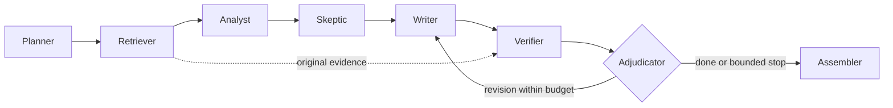

<div align="center">

# ◈ Verity

### Follow the evidence. Question the conclusion.

An open financial research observatory: eight specialized roles, independent claim checks, and a research process you can inspect.

[Explore the demo](#try-it) · [The research process](#the-research-process) · [50-paper research ledger](docs/research-ledger.md) · [API](#api) · [Development](#development)

</div>

---

A polished report can hide a weak argument. A citation can point to a document that never supported the claim. Verity makes that gap visible.

Give it a company ticker. The system retrieves SEC filings and market context, computes financial ratios, challenges the analysis, and drafts a cited research note. An independent verification pass checks cited claims against the original retrieved text. A bounded review loop requests corrections and keeps unresolved claims visible.

**You get the research note and the record behind it:** agent handoffs, source excerpts, verification routes, skeptical observations, and downloadable results.


## Watch the evidence change the report


*An actual execution of the offline synthetic case, rendered through the same observatory component as the app. Planning, retrieval, analysis, skepticism, and writing use fixtures; the local verification cascade actually executes. This is not live market research or a financial-accuracy benchmark.*

The example intentionally starts with a $900 million revenue claim against a source stating $120 million. The verifier flags the mismatch, the adjudicator requests revision, and the corrected exact statement passes the next check. The original [workflow animation](assets/readme/agent-workflow.gif) is retained as a historical six-stage illustration.

A complete live NVIDIA run has also been checked with Gemini, SEC filings, and yfinance. See the [live validation record](docs/live-validation.md) and [saved report](reports/NVDA_live_research.md), including its unresolved verification flags.

## What you can do

| Feature | What it gives you |
|---|---|
| Research observatory | A session log beside an agent map, driven by actual started/completed/failed events |
| Evidence ledger | Filter supported claims and claims needing review; inspect independent excerpts and verification routes |
| Skeptical review | A dedicated pass to surface assumptions, missing evidence, and possible counter-evidence before writing |
| Bounded revision | A deterministic adjudicator stops unchanged drafts and enforces the review limit |
| Evidence lab | Paste a claim and source passage for local, key-free checking |
| Run history | SQLite snapshots retain results and agent checkpoints across API restarts |
| Stop control | Request cancellation at the next agent boundary |
| Exports | Download the research note as Markdown and the run record as JSON |
| Offline sample | Explore the interface without keys or external data services |

## Try it

Python 3.10+ is required. Create a virtual environment and install the dependencies:

```bash
python -m venv .venv
```

```powershell
# Windows PowerShell
.venv\Scripts\Activate.ps1
```

```bash
# macOS / Linux
source .venv/bin/activate
```

```bash
pip install -r requirements.txt
python run_app.py
```

The launcher starts the research API and dashboard together and opens [localhost:8501](http://localhost:8501). On Windows you can also double-click `start.bat`. Configure the Gemini key in `.env` first. To explore without a key, start only the dashboard with `streamlit run ui/app.py` and choose **Explore a sample run**. The sample and evidence lab work without the API, Gemini, or network access. The optional web fonts may fall back to system fonts offline.

### Configure live company research

Copy [.env.example](.env.example) to `.env`, then configure your model key and SEC contact identity:

```dotenv
GEMINI_API_KEY=your_key_here
SEC_USER_AGENT=YourName/1.0 contact@example.com
VERIFICATION_BACKEND=rules
VERIFICATION_REMOTE_BUDGET=24
RESEARCH_MODE=fast
VERIFIER_MAX_RETRIES=2
```

Start both services with `python run_app.py` or double-click `start.bat`. For separate terminals, start the API with:

```bash
uvicorn api.main:app --host 127.0.0.1 --port 8000
```

Refresh the dashboard, enter a ticker such as `AAPL`, and choose **Begin research**. Live runs need network access and use Gemini generation, SEC EDGAR, and yfinance. Document retrieval defaults to persistent local BM25, which avoids embedding-service quota. Optional semantic retrieval requires `pip install -r requirements-semantic.txt` and `RETRIEVAL_BACKEND=gemini`; it uses batched `gemini-embedding-001` vectors. Optional news retrieval uses `NEWS_API_KEY`. Model availability and quotas depend on your provider account. Configure `GEMINI_MODEL` if needed.

`VERITY_API_URL` can point the dashboard at another API address. Put credentials in the private `.env` file, never in `.env.example`. The configured model must be available to your account; `gemini-3-flash-preview` was verified in the live check. Keys are configured on the API server; the dashboard does not collect or change a shared server key.

## The research process


```mermaid
flowchart LR
    P[Planner] --> R[Retriever]
    R --> A[Analyst]
    A --> S[Skeptic]
    S --> W[Writer]
    W --> V[Verifier]
    V --> J{Adjudicator}
    J -->|revision within budget| W
    J -->|done or bounded stop| F[Assembler]
    R -. original evidence .-> V
```

| Role | Responsibility |
|---|---|
| Planner | Resolve the company and prepare a research brief |
| Retriever | Gather filings, XBRL facts, market data, and optional news; retain independent text |
| Analyst | Compute ratios in Python and interpret the supplied data |
| Skeptic | Challenge the analysis using targeted risk excerpts; distinguish observations from hypotheses |
| Writer | Draft the note with exact source labels and address the review |
| Verifier | Check cited claims against original retrieved evidence; preserve uncertainty |
| Adjudicator | Decide whether to revise or stop; never convert an unsupported claim into a supported one |
| Assembler | Package the report, citations, and unresolved flags |

These are **eight workflow roles**, not eight independent models. Several roles combine model calls with deterministic tools; adjudication and assembly are ordinary Python. The workflow is intentionally ordered, not a parallel debate swarm.

### A small, project-owned runtime

Verity now uses [its own Python orchestrator](agents/runtime.py), replacing LangChain/LangGraph dependencies. Nodes exchange explicit state, the runtime emits event envelopes, and the API saves checkpoints under one run ID. The compatibility functions `build_graph()`, `.invoke()`, and `.stream()` remain available.

This choice keeps the workflow easy to inspect. It also means distributed scheduling, automatic checkpoint resume, and framework-level durable execution are not supplied. A restarted service marks unfinished runs **interrupted** and preserves their last checkpoint for inspection.

The design draws on role contracts from [MetaGPT](https://arxiv.org/abs/2308.00352), feedback loops from [Reflexion](https://arxiv.org/abs/2303.11366), verification separation from [Chain-of-Verification](https://arxiv.org/abs/2309.11495), and failure analysis from [MAST](https://arxiv.org/abs/2503.13657). The [research ledger](docs/research-ledger.md) records 50 paper scans, six primary technical/design sources, adopted ideas, deferred alternatives, and an evaluation plan. This is a project-specific synthesis, not a reproduction or a claim of validated algorithmic novelty.

## How verification works

The existing **BACE — Budgeted, Anchored Claim Evaluation** cascade remains the evidence gate:

1. Retrieve source-scoped sentences with BM25.
2. Accept complete exact matches and narrowly defined financial field observations. Compare rounded values at their displayed precision, preserving percent units, field identity, issuer identity, and polarity. Flag genuine numeric mismatches.
3. Optionally apply a local NLI model to remaining passage–claim pairs.
4. Judge remaining candidates in one structured Gemini batch within the configured claim budget; abstain on missing, uncertain, or invalid verdicts. Cache determinate judgments only while the source content and issuer context remain unchanged.

Fast mode uses local planning, arithmetic summaries, and an excerpt-based review contract. Gemini writes the report and judges unresolved claims in a batch. `RESEARCH_MODE=deep` enables additional model planning, analysis, and skeptical review. A full rewrite is requested only when the checker provides a concrete correction; insufficient evidence is flagged without regenerating the report. Truncated provider output is retried with a larger output allowance or fails explicitly.

The writer's quotation is never treated as independent evidence. The remote verification budget carries across report revisions. It counts logical claim judgments, not provider retries, tokens, dollars, generation calls, or embeddings.

```python
from research.cascade import Cascade

result = Cascade().verify(
    claims=[{"source": "example", "claim": "Revenue was $900 million."}],
    documents=[{"source": "example", "text": "Revenue was $120 million."}],
)
print(result["verdicts"][0]["decision"])
# abstain — needs review; no cloud call
```

For optional neural verification, install `requirements-local.txt` and set `VERIFICATION_BACKEND=torch` or `onnx`. First use downloads a pinned DeBERTa NLI model; ONNX may export artifacts. Thresholds remain uncalibrated for finance. Setting the remote budget to zero disables remote **verification**, not Gemini generation or optional semantic embeddings used in live research.

## API

Interactive documentation: [localhost:8000/docs](http://localhost:8000/docs).

| Endpoint | Behavior |
|---|---|
| `POST /research/{ticker}` | Start a live research run; returns a run ID |
| `GET /research/{run_id}` | Report and review details; HTTP 202 while running |
| `GET /research/{run_id}/events?after=0` | Ordered lifecycle events after a sequence cursor and current run status |
| `POST /research/{run_id}/cancel` | Request a stop at the next agent boundary |
| `GET /research/{run_id}/citations` | Claim-level verification records |
| `GET /research/{run_id}/trace` | Tool and agent audit entries |
| `GET /runs` | Recent saved runs |
| `POST /verify` | Local rules-only checking of supplied claims and documents |
| `GET /health` | Service availability and model-configuration status |

## Development

```bash
python -m pytest -q
```

Tests cover the correction loop, stagnation, cancellation, missing evidence, failure propagation, identity preservation, persisted events, restart status, source attribution, numeric guards, remote budgets, API validation, and financial calculations. These are behavior tests, not a financial-domain accuracy evaluation.

```text
agents/       Specialized roles, custom runtime, synthetic demo
research/     Source-scoped retrieval and verification cascade
api/          Live events, background jobs, SQLite run snapshots
ui/           Streamlit observatory and shared diagram renderer
tools/        SEC / market access, computation, vector storage
docs/         Research ledger and evaluation direction
```

Recreate the screenshots and GIF with a running dashboard:

```bash
pip install playwright pillow
playwright install chromium
python tools/capture_observatory.py
```

The older `python -m eval.eval` evaluation uses live network/model services. For a meaningful comparison of the new skeptical workflow, use held-out companies and periods, human-labeled claims, fixed model/data conditions, and measured latency, tokens, cost, false acceptance, and abstention. See the ledger for the proposed ablations.

## Boundaries worth understanding

Source agreement does not establish truth. Verification checks extracted citations; uncited factual claims are not comprehensively detected. Exact source naming, tables, derived metrics, complex unit conversions, multi-sentence claims, and context truncation remain limitations. The skeptical review is model-generated commentary, not independently verified evidence.

This is a local research prototype. The API has no authentication or distributed queue and allows at most two concurrent runs per process. Keep it on a trusted local interface. Cancellation waits for an active agent to finish; checkpoints do not provide automatic resume. The new orchestration has not established better investment accuracy, reduced hallucinations, or lower provider cost on a live financial benchmark.

The interface takes inspiration from the user-provided [physics-intern Space](https://huggingface.co/spaces/huggingface/physics-intern): a readable session log alongside a visible agent network. Verity's layout, implementation, and financial workflow are its own.
